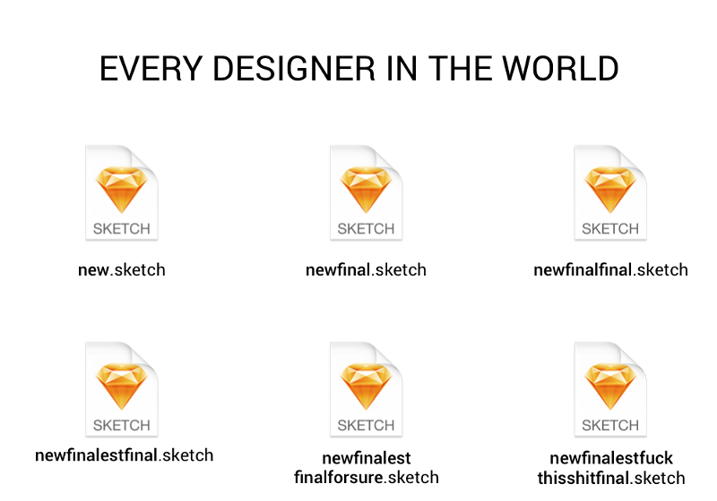
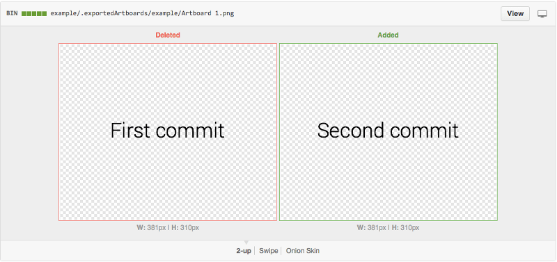

[Version control](https://git-scm.com/book/en/v2/Getting-Started-About-Version-Control) is a system which records and stores every change made to a set of files, so that you can go back to a previous state at any time. Developers have been using this method for a long time (the first kind of version control system was developed in the 70s) and it is now unthinkable to seriously write software without one.

In contrast, version control is something that most designers neglect, or don’t even think about. And as a result, these designers (and their teams) would often face the classical problems of the pre-version-control era, such as:

- obscure/creative file names to keep track of the different versions
- no clear way to distinguish what’s still relevant from old/deprecated drafts
- no quick way for team members to check what changed between two versions
- bad manipulation resulting in the loss of the last 2 hours of work
- etc.

### What about Dropbox?

At [Enki](https://enki.com/), we use [Sketch](http://sketchapp.com/), and it’s great. But until recently, we were sharing the sketch file on Dropbox, and it was less great…

For example, to check the latest changes, we would open the Sketch file and start scrolling around. Sketch has this nice little feature called “autosave”. And scrolling around is considered a change to the Sketch file. So we would end up with multiple conflicting copies of the **same** file without any actual change.

This is only one of many issues that we had with Dropbox, and they old boiled down to the same root cause: lack of _control_.

We love automation, like most people do. But the whole point of _version control_ is to bring some order and meaning to the evolution of your content. You want to distinguish small changes from significant ones (those worth notifying your team). You want to distinguish little private experiments (the one you may never share) from the actual experiments. Most importantly, you want to describe your changes _concisely_, with actual human words. For your own benefit (to remember what you did recently), and for the benefit of your team!

None of these things can be controlled with Dropbox.

### Why is git so much better?

Those of you already familiar with _git_ may want to skip this section. For the others: think of git as the state of the art in version control. It gives you a TON of control and provides all the features needed to accommodate hundreds of possible workflows. You can maintain multiple versions of a file, conduct multiple experiments and yet preserve a clean “latest” version of your work. It lets you roll back your changes when needed, and you can even rewrite history when you feel like it.

In a nutshell: git is an extremely smart and powerful tool.

It is also a very mature and stable tool, used and maintained by a vibrant community of developers, in particular in the open-source world. It combines all the best features of its predecessors (e.g. cvs, svn) and only falls short technically on rare edge-case scenarios. Therefore, professional developers rarely wonder if they should git. They do it by default.

### So why are designers not using git already?

There are three main answers to this question. The first answer — which I consider to be the _wrong_ answer — is that git is too “complex” for designers. Granted, git is not a trivial tool to get used to. Junior developers also need a bit of practice before getting really familiar with it. But understanding the core functionality of git does _not_ require a degree in computer science, or years of programming experience. All it really takes is a bit of time to study.

A second answer — more accurate IMO — is that the designer community has not yet gotten into the habit and the culture of using git. It took years for developers to make git a standard. And some technical teams (e.g. in the banking sector) are still reluctant to change their old ways of doing things (e.g. using svn, a predecessor of git). In the same way, the designer community needs to _demystify_ git and build confidence in its value. And this will take a bit of time.

The third answer — and the most actionable one — is that git is primarily designed for _code_ (as in: text files) rather than designs (as in: sketch files and pictures). There is some truth in that, since there is no easy way to compare sketch files with each other. Same for PSD files.

There is room for HUGE improvement here and I really believe that the next design tool will need to come up with a “comparable” file format if it wants to drastically improve designers’ productivity.

But in the meantime, it shouldn’t stop us to take actions right now.

### How I’m trying to help

I created a [sketch plugin](https://github.com/mathieudutour/git-sketch-plugin) allowing designers to use git directly in Sketch. The plugin really improves the review process by exporting an image for every part of the design. Every member of the team can quickly see what the next iteration will change through Github’s interface.

From…

To…

Each step of the design process is now documented. Newcomers are able to understand how we ended up with the current iteration and why we went with some options and not others.

It’s not perfect yet; the sketch file stays “un-mergable”, i.e. it’s impossible for git to reconcile two different modifications of the same file. If 2 team members are working on a different part of the same file at the same time, git won’t know what to do.

In comparison, when working on a text file (source code for example), git looks at the modified lines and merges them together. If we were not working on the same lines, there is no problem.

If a sketch (or PSD, etc.) could be represented as a text file, we would finally be able to work at the same time, on the same file.

### Now, how can YOU help?

Turns out that there is a tool for Sketch which transforms a file into a JSON (JavaScript Object Notation) file which is basically a text file. Unfortunately, the transformation is not bi-directional, i.e. it’s not (yet?) possible to go create a Sketch file from the JSON representation.

If this feature becomes available, an ocean of possibilities will open up.

But you don’t need to wait for Sketch to add this feature to start learning how to be proficient with git. Here are a [lot](http://doc.gitlab.com/ee/workflow/gitlab_flow.html) [of](https://try.github.io/levels/1/challenges/1) [very](https://git-scm.com/book/en/v2/Getting-Started-Git-Basics) [nice](http://www.vogella.com/tutorials/Git/article.html) [introductions](http://rogerdudler.github.io/git-guide/) to git. At Enki, we have also just launched the git topic so if you’d like some tips and tricks on-the-go related to git, do [check it out](https://enki.com).

---

**EDIT**: Sketch recently changed their file format. It is now possible (with some work) to compare files and merge them! I wrote a follow-up here: [https://medium.com/kactus-io/unlocking-true-collaboration-around-design-f844527220cb](https://medium.com/kactus-io/unlocking-true-collaboration-around-design-f844527220cb)
